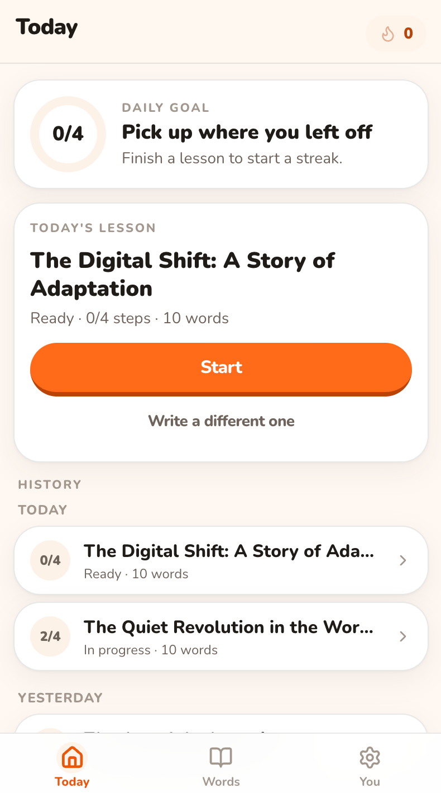
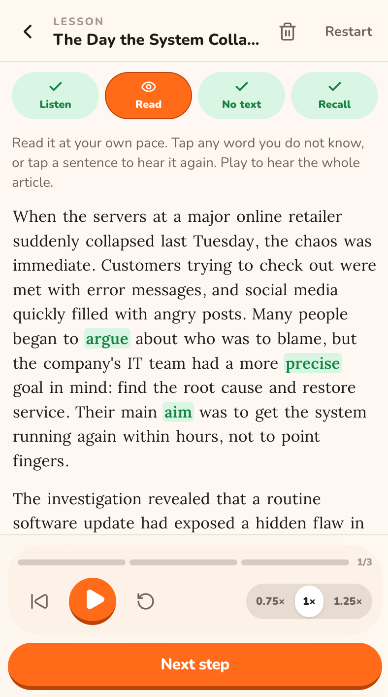
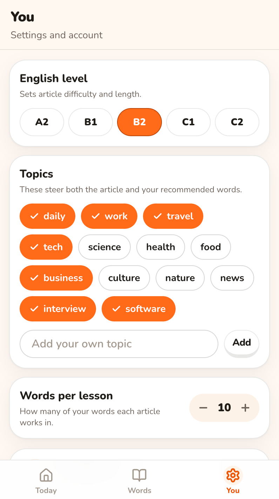

<p align="center">
  
</p>

<h1 align="center">Daily English</h1>

<p align="center">
  <strong>One article a day, built from the words you are learning.</strong><br>
  Save the words you meet. Hear them in a story. Read, then recall.
</p>

<p align="center">
  <a href="https://english.readish.app">english.readish.app</a>
  ·
  <a href="#development">Development</a>
  ·
  <a href="#license">License</a>
</p>

<table>
  <tr>
    <td align="center" valign="top" width="33%">
      
      <br><sub>Today</sub>
    </td>
    <td align="center" valign="top" width="33%">
      
      <br><sub>Lesson</sub>
    </td>
    <td align="center" valign="top" width="33%">
      
      <br><sub>You</sub>
    </td>
  </tr>
</table>

## What it is

Daily English is a mobile-first PWA for learners who already collect vocabulary and need somewhere to *use* it. Each lesson is one short article written from the words on your list, read aloud in General American, then checked with a quick recall round. Five minutes, once a day.

Live at [english.readish.app](https://english.readish.app). Sign in with Google.

## A lesson

1. **Listen** — hear the article once, without reading first.
2. **Read** — follow the text, tap a word for a gloss, tap a sentence to hear it again.
3. **Listen again** — the whole article, a little faster, now that you know what it says.
4. **Recall** — a short quiz on the language that actually appeared.

Playback is 0.75× / 1× / 1.25×. Articles stay on your account: an unfinished lesson opens where you left it, and a finished one can be stepped through again.

Between lessons there is **Explore**, a deck of word cards at your level to flick through — your own saved words, new ones from the pool, or both.

## Stack

| Piece | Choice |
| --- | --- |
| App | [TanStack Start](https://tanstack.com/start) (React 19) on [Cloudflare Workers](https://developers.cloudflare.com/workers/) |
| Data | D1 (SQLite) via Drizzle, R2 for audio |
| Writing | DeepSeek |
| Speech | OpenAI `gpt-4o-mini-tts` |
| Words | A CEFR-tagged pool in-repo, plus a Chrome extension to save from any page |

The Chrome extension lives in `packages/chrome-extension`. It adds a selected word to the same list the site uses.

## Development

**pnpm only.** Node 22.

```bash
pnpm install
cp .dev.vars.example .dev.vars   # then fill in keys you actually need
pnpm mock:ai                     # http://127.0.0.1:8799 — keep this running
pnpm dev                         # http://localhost:4000
```

`pnpm mock:ai` stands in for DeepSeek and OpenAI speech so a local run does not spend API credit. The mock writes placeholder prose on purpose. On the login screen, **Sign in as the test learner** exists only in development.

```bash
pnpm check   # typecheck, tests, production build — this is what CI runs
```

More detail: [local development](docs/agents/local-dev.md), [testing](docs/agents/testing.md).

## Vocabulary data

`src/data/vocabulary.ts` is generated from the [CEFR-J](https://www.cefr-j.org/) and Octanove vocabulary profiles ([CC BY-SA 4.0](https://creativecommons.org/licenses/by-sa/4.0/), via Open Language Profiles) plus a web-frequency list. Rebuild with `pnpm vocab`. Do not hand-edit the output.

That file is an adaptation of CC BY-SA 4.0 data, so it stays under [CC BY-SA 4.0](https://creativecommons.org/licenses/by-sa/4.0/) whatever the rest of the repository is licensed as. The share-alike condition came with the data and does not go away.

## License

[PolyForm Noncommercial 1.0.0](LICENSE). Read it, learn from it, change it, build on it — for any noncommercial purpose. Commercial use is not granted, and that includes running it as a service for other people.

It is not a self-hosting kit either. `wrangler.jsonc` is wired to the live account, and what actually makes the app work — the domain, the D1 database, the R2 bucket, the model keys — is not in here. There are no instructions for standing up your own copy, and no support for it.
